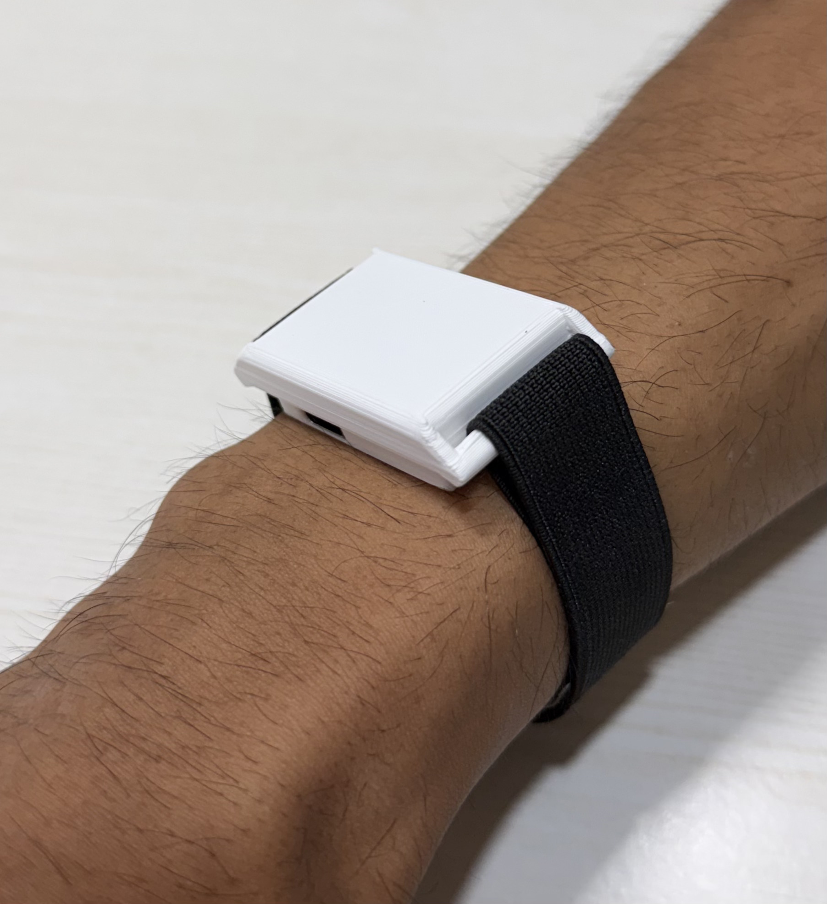
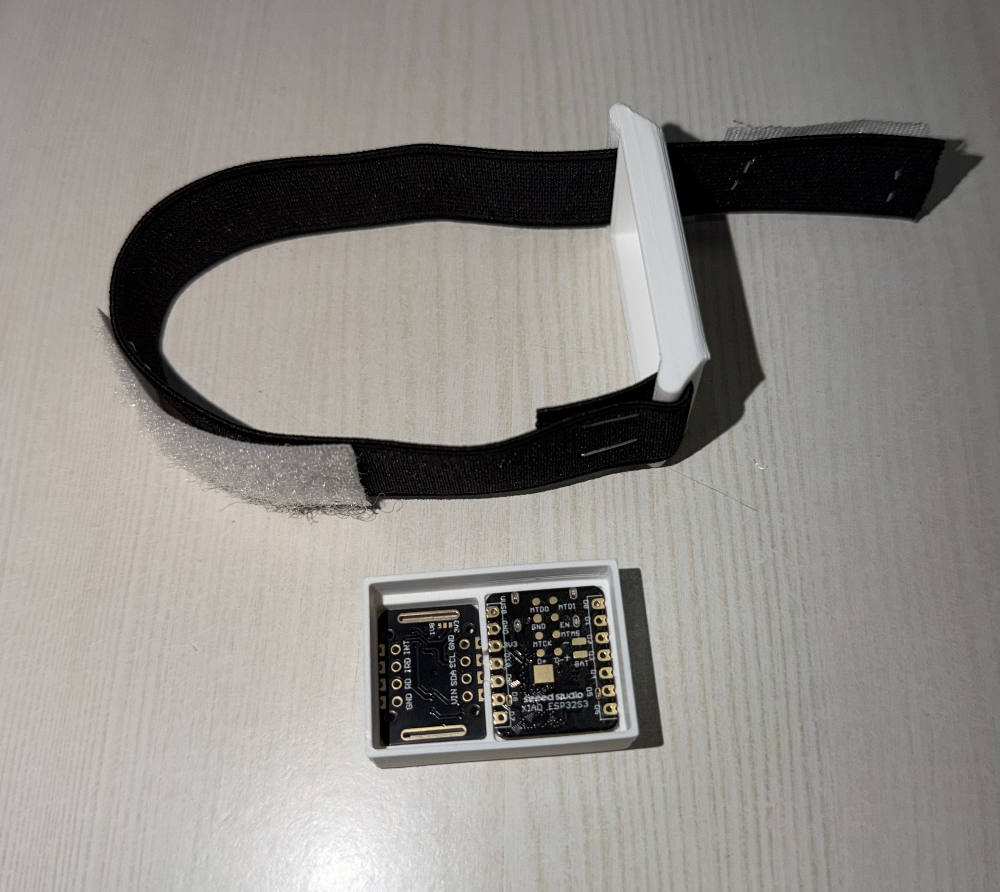
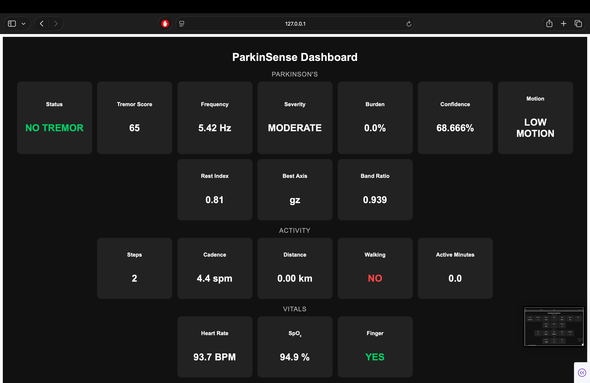
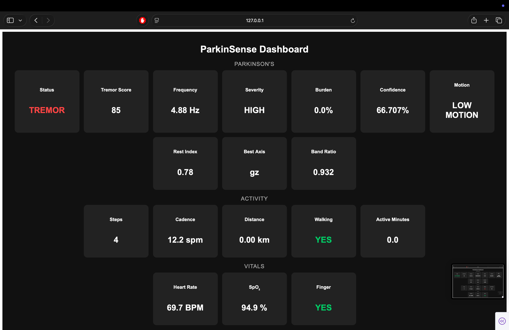
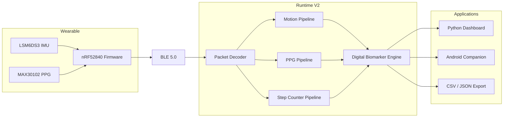
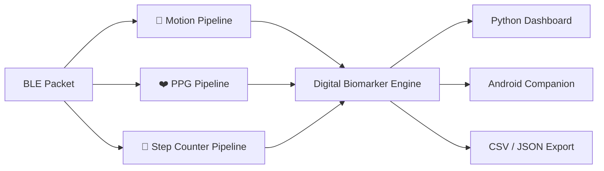

<div align="center">

# 🧠 ParkinSense

### Continuous Neurological Monitoring & Digital Biomarker Platform

*An open-source wearable research platform for continuous Parkinson's disease monitoring through embedded sensing, physiological analytics, activity recognition, and real-time digital biomarkers.*

<br>



<br><br>


</div>

---

## 📑 Table of Contents

- [At a Glance](#-at-a-glance)
- [Platform Overview](#-platform-overview)
- [Why ParkinSense?](#-why-parkinsense)
- [Why Another Parkinson's Wearable?](#-why-another-parkinsons-wearable)
- [Core Features](#-core-features)
- [Development Branches](#-development-branches)
- [System Architecture](#️-system-architecture)
- [Design Principles](#-design-principles)
- [Hardware Platform](#-hardware-platform)
- [Firmware](#-firmware)
- [Battery Optimization](#-battery-optimization)
- [BLE Protocol](#-ble-protocol)
- [Signal Processing Pipeline](#-signal-processing-pipeline)
- [Cross-Pipeline Fusion](#-cross-pipeline-fusion)
- [Digital Biomarkers](#-digital-biomarkers)
- [Dashboard](#-dashboard)
- [Android Companion Application](#-android-companion-application)
- [Repository Structure](#-repository-structure)
- [Getting Started](#-getting-started)
- [Performance](#-performance)
- [Development Roadmap](#️-development-roadmap)
- [Research Focus](#-research-focus)
- [Current Limitations](#-current-limitations)
- [Future Vision](#-future-vision)
- [Contributing](#-contributing)
- [Citation](#-citation)
- [License](#-license)
- [Disclaimer](#️-disclaimer)

<br>

---

## 🚀 At a Glance

ParkinSense is an end-to-end wearable platform for continuous neurological monitoring, built on embedded sensing, Bluetooth Low Energy communication, digital signal processing, and real-time analytics.

Unlike most academic prototypes that focus on a single sensing modality or offline analysis, ParkinSense runs **three parallel processing pipelines** — motion, physiological, and activity — from one synchronized sensor stream, and pairs that with a native Android companion app and a live Python dashboard.

The project spans the complete wearable stack: from firmware on a Nordic nRF52840 MCU, through a modular Python signal-processing runtime, to a full Android application capable of on-device biomarker generation.

| | |
|---|---|
| 🧠 | Research platform for continuous Parkinson's disease monitoring |
| 📐 | 6-axis IMU + optical PPG sensor fusion |
| 📡 | Bluetooth Low Energy 5.0 streaming at ~104 Hz |
| ❤️ | Heart rate, HRV & SpO₂ estimation |
| 👣 | Real-time step counting, cadence & activity recognition |
| 📱 | Native Android companion application |
| 📊 | Live Plotly Dash dashboard |
| ⚡ | Power-optimized wearable (~100 hr estimated runtime) |
| 🧩 | Modular, independently-testable signal-processing architecture |
| 🤖 | Machine-learning ready |
| 🌍 | Fully open source |

<br>

---

## 📸 Platform Overview

<div align="center">

| Wearable — On Wrist | Wearable — Enclosure Open |
|:---:|:---:|
|  |  |

| Dashboard — Resting State | Dashboard — Tremor Detected |
|:---:|:---:|
|  |  |

</div>

<br>

---

## 🎯 Why ParkinSense?

Parkinson's disease is traditionally assessed during short clinical visits, providing only brief snapshots of symptoms that fluctuate throughout the day.

ParkinSense was built to explore a different approach: rather than isolating one channel, it continuously combines motion sensing, physiological sensing, activity tracking, and edge signal processing to generate objective digital biomarker estimates throughout everyday life.

The platform is designed as a modular research ecosystem, so new sensors, algorithms, machine-learning models, and clinical studies can be integrated without redesigning the entire software stack. Its goal is not simply to detect tremor — it's to provide a flexible foundation for future research in wearable neurology.

<br>

## 🌐 Why Another Parkinson's Wearable?

Most wearable projects targeting Parkinson's tremor stop at a single sensing channel — typically inertial tremor quantification, often processed offline after the recording session ends. ParkinSense integrates motion sensing, PPG (cardiac) sensing, activity tracking, BLE streaming, a live dashboard, a native Android companion app, a Python reference runtime, dataset generation, and ongoing research into one platform.

Concretely, this means:

- **Motion + Cardiac + Activity** biomarkers come from a single synchronized sensor stream, not three separate tools bolted together.
- **Real-time, on-device processing** across all three pipelines, rather than an offline post-processing step.
- **Cross-pipeline gating** — the same motion-context classification that flags tremor is reused to gate the step counter (rejecting tremor/handling artifacts) and to discount PPG confidence during movement, instead of each channel re-deriving its own notion of "is the body moving."
- **Two access paths** — a Python reference stack for research and algorithm development, and a native Android app for standalone, Python-free deployment.
- **A documented, replicable architecture** — filter orders, window lengths, state-machine transitions, and confidence heuristics are described in enough detail to be reproduced or extended.

This is an architectural comparison — an integrated, multi-modal platform versus a single-channel tool — not a performance claim. ParkinSense has not yet undergone the kind of clinical validation that some single-modality tremor wearables have already completed, and every metric it reports is explicitly labeled research-grade pending that validation (see [Disclaimer](#️-disclaimer)).

<br>

---

## ✨ Core Features

### 🧠 Motion Monitoring
- Continuous 104 Hz IMU acquisition (LSM6DS3 accelerometer + gyroscope)
- Binary BLE packet streaming
- Multi-axis tremor detection with false-positive rejection
- Motion-context classification (REST / LOW MOTION / ACTIVE)
- Confidence estimation & tremor burden tracking

### ❤️ Physiological Monitoring
- MAX30102 optical sensor (IR + RED acquisition)
- Finger-presence detection with hysteresis
- Signal Quality Index (SQI) & sensor status classification (`NO_FINGER` / `LOW_SIGNAL` / `POOR_SIGNAL` / `GOOD` / `HIGH_SIGNAL` / `SATURATED`)
- Adaptive peak detection and RR interval extraction
- Heart rate estimation with EMA stabilization and confidence scoring
- Heart rate variability — RMSSD, SDNN, Mean RR, pNN50
- SpO₂ estimation (ratio-of-ratios with a signal-lock state machine)
- Motion-aware heart rate confidence fusion

*Upcoming: recovery score, sleep analytics.*

### 👣 Activity Monitoring
- Real-time step counting from accelerometer magnitude
- High-pass filtering to remove gravity / slow drift
- Adaptive, self-tuning detection threshold (rolling mean + k·σ)
- Hysteresis-based peak detection (no double-counting per step)
- Refractory-period gating against implausibly fast "steps"
- Motion-state gated detection — tremor/handling can't register as steps
- Multi-step walking confirmation before declaring "walking"
- EMA-smoothed cadence (steps/min and Hz)
- Distance estimation from configurable step length
- Bout-based active-minute accounting
- Per-step and walking-regularity confidence heuristics

*Upcoming: activity-type classification (walk vs. run vs. climb), floors climbed, calorie estimation, VO₂ max.*

### 💻 Software Platform
- Modular V2 signal-processing pipeline (motion + PPG + activity)
- Unified runtime combining all three pipelines
- Live Plotly Dash dashboard with neurological, physiological, and activity panels
- Native Android companion app with its own dashboard, recording, replay, and export
- Two power-optimized firmware variants (v3 development / v4 power-optimized)
- Offline dataset recorder, realtime CSV logging, JSON metrics export
- Replay framework for algorithm validation
- Research-oriented, ML-ready architecture

<br>

---

## 🌳 Development Branches

| Branch | Purpose |
|---|---|
| **`main`** | Stable, validated release — V2 motion pipeline, stable BLE streaming, real-time dashboard, offline analytics |
| **`feature/v2-signal-processing`** | Historical redesign branch that took the pipeline from FFT-only detection to the current modular filter → context → detector → confidence → state-machine architecture |
| **`develop`** 🔧 *current* | Adds physiological sensing, activity tracking, the Android companion app, and v4 power-optimized firmware |

**`develop` highlights:** MAX30102 integration · binary packet upgrade · IR/RED streaming · finger detection with hysteresis · SQI + sensor status · PPG pipeline (`ppg/ppg_processor.py`, `ppg/algorithms.py`) · heart rate, HRV, and SpO₂ estimation · step tracking pipeline (`StepCounter`) · cadence, distance, and active-minute accounting · unified runtime merging all three pipelines · updated dashboard · v4 firmware · native Android app.

<br>

---

## 🏗️ System Architecture

ParkinSense follows a modular, end-to-end architecture where each component has a single responsibility — from embedded sensing to digital biomarker generation, every stage operates independently while integrating seamlessly with the rest of the platform.



The system consists of four major layers:

- **Wearable Hardware** — acquires motion and physiological signals.
- **Firmware & BLE Layer** — samples sensors and streams synchronized packets.
- **Processing Layer** — extracts neurological, physiological, and activity biomarkers.
- **Visualization Layer** — presents results through the Python and Android applications.

<br>

## 🧭 Design Principles

- **Modular** — every subsystem has a clearly defined, single responsibility, independently testable.
- **Real-Time** — all processing occurs continuously as sensor data arrives.
- **Research-First** — algorithms are implemented for transparency, reproducibility, and experimentation rather than as opaque black boxes.
- **Extensible** — additional sensors, pipelines, or ML models can be integrated without redesigning the existing architecture.
- **Cross-Platform** — the same BLE protocol powers both the Python Runtime and the Android Companion App, ensuring algorithm parity.
- **Runtime independent from the dashboard** — computation and visualization never share responsibility.

<br>

---

## 🔌 Hardware Platform

<div align="center">


<em>Current wearable prototype — XIAO nRF52840 Sense in a 3D-printed enclosure</em>
</div>

<br>

### Wearable Device

| Component | Specification |
|------------|----------------|
| MCU | Seeed Studio XIAO nRF52840 Sense |
| Processor | Nordic nRF52840 (64 MHz ARM Cortex-M4F) |
| Motion Sensor | SparkFun LSM6DS3 6-axis IMU |
| Physiological Sensor | MAX30102 optical PPG |
| Connectivity | Bluetooth Low Energy 5.0 |
| Battery | 3.7 V 700 mAh Li-ion (902035) |
| Charging | USB-C |
| Expansion | I²C |

### Why These Components?

Every hardware component was selected to balance power consumption, processing capability, and research flexibility rather than simply maximizing specifications.

- **Nordic nRF52840** — provides BLE 5.0, floating-point DSP, ultra-low-power operation, and a mature SDK ecosystem, ideal for continuous wearable sensing.
- **LSM6DS3 IMU** — 3-axis accelerometer + 3-axis gyroscope, used for tremor detection, motion context, walking detection, step counting, and cadence estimation. Sampled at **104 Hz**.
- **MAX30102** — enables heart rate, RR intervals, HRV, SpO₂, finger detection, and signal-quality estimation. Sampled at **~50 Hz**.

### Operating Configuration

| Parameter | Value |
|------------|--------|
| Accelerometer / Gyroscope ODR | 104 Hz |
| PPG (IR/RED) Sampling | ~50 Hz |
| BLE Streaming | ~104 Hz |
| BLE MTU | 247 Bytes |
| Samples / Packet | 10 |
| Packet Size | 248 Bytes |
| Motion Analysis Window | 4 seconds |
| PPG Analysis Window | 10 seconds (rolling) |
| Step Detector Adaptive Window | ~2 seconds |
| Dashboard Refresh | 100 ms |

<br>

---

## 🧩 Firmware

The firmware is intentionally lightweight. Its only responsibility is reliable sensor acquisition and BLE communication — signal processing happens entirely in the Runtime Engine or Android application. This separation keeps the firmware deterministic while allowing algorithms to evolve independently.

**Responsibilities:** sensor initialization · timestamp generation · IMU + optical sampling at their native rates · binary packet assembly · BLE transmission · sensor availability monitoring · power management.

### Firmware Variants

| | v3 Firmware | v4 Firmware |
|---|---|---|
| Purpose | General development | Power-optimized wearable deployment |
| Debugging | Maximum — serial logging, verbose output | Debug-gated, minimal overhead |
| Recommended for | Development, debugging, algorithm testing | Continuous, all-day wearable operation |
| Power behavior | Not power-optimized | Deep sleep, optimized BLE scheduling, reduced processing overhead |

**v3** prioritizes visibility over efficiency — the right choice while implementing features, tuning algorithms, or validating new pipeline changes. **v4** builds directly on v3 and adds the power-optimization layer required for actual wearable deployment, while keeping the sensing architecture identical to preserve algorithm parity between development and deployment.

**Location:** `firmware/xiao_nrf52840/`

<br>

## 🔋 Battery Optimization

Battery life is achieved through firmware design rather than simply increasing battery capacity.

✔ **Deep Sleep** — when the MAX30102 detects loss of skin contact, the firmware stops sensing and processing and enters an ultra-low-power sleep state.

✔ **Automatic Wake-up** — streaming resumes automatically when skin contact returns; no button required.

✔ **Sensor-aware Power Management** — the PPG pipeline's finger-presence signal directly controls the wearable's power state, so power is only spent while the device is actually being worn.

✔ **BLE Optimization** — packets are scheduled efficiently to minimize radio activity while maintaining continuous throughput.

### Measured Performance

Power was measured on the assembled wearable prototype using a **Nordic Power Profiler Kit II** — measured, not estimated from component datasheets.

| Mode | Current |
|------|----------|
| Active Streaming (sensing + BLE) | ~7 mA |
| Deep Sleep | Microamp range |

**Battery:** 3.7 V, 700 mAh Li-ion · **Estimated runtime:** ~100 hours continuous, based on the measured ~7 mA active current.

> Runtime estimate is calculated using the measured average active current and battery capacity. Actual runtime depends on operating conditions and BLE activity.

<br>

---

## 📡 BLE Protocol

Each BLE notification contains one synchronized packet:

```text
┌─────────────────────────────────────┐
│ Header                               │
│   Version   (1B)                     │
│   Flags     (1B)                     │
│   Reserved  (2B)                     │
│   Timestamp (4B)                     │
├─────────────────────────────────────┤
│ 10 × Samples                         │
│   Acc X · Acc Y · Acc Z   (int16)    │
│   Gyro X · Gyro Y · Gyro Z (int16)   │
│   IR                       (uint32)  │
│   RED                      (uint32)  │
└─────────────────────────────────────┘
```

The versioned packet format allows future additions while maintaining backward compatibility between firmware and runtime. This synchronized structure ensures neurological, physiological, and activity pipelines operate on temporally aligned sensor data, simplifying sensor fusion and replay across both the Python Runtime and Android Companion App. Both the PPG pipeline and the step counter run off the same decoded accelerometer stream — no additional wire format changes were required to add step tracking.

<br>

---

## 🔬 Signal Processing Pipeline

ParkinSense runs **three parallel processing pipelines** from the same BLE packet stream. Each stage has a single responsibility, so algorithms can be validated, replaced, or extended without affecting the rest of the system.



### 🧠 Motion Pipeline

Responsible for continuous neurological assessment using synchronized accelerometer and gyroscope data. Its objective is not simply to detect tremor, but to determine whether observed motion is consistent with Parkinsonian rest tremor while rejecting voluntary movement and environmental artifacts.

| Stage | Purpose |
|---------|---------|
| Rolling Buffer | 4-second analysis window for stable FFT resolution and lower false-positive rates |
| Gravity Removal | A low-pass estimator subtracts the gravity component, separating orientation from motion |
| Notch Filter | Digital 50 Hz filter rejects mains electrical interference |
| Butterworth Band-pass | Isolates the Parkinsonian tremor band (4.0–6.5 Hz) |
| Motion Context | Classifies each window as `REST` / `LOW MOTION` / `ACTIVE` |
| Feature Extraction | RMS, dominant frequency, band ratio, spectral entropy/centroid, zero-crossing rate, frequency stability per axis |
| Tremor Detector | Scores all three gyroscope axes simultaneously; tremor declared at a composite score ≥ 80/100 |
| Confidence Estimator | Reduced when dominant frequency is unstable, tremor-band energy is weak, or wrist motion is excessive |
| Temporal Validator | Requires 5 positive windows out of a rolling 10 before confirming tremor |
| State Machine | Hysteresis-based states (`NO TREMOR → POSSIBLE → CONFIRMED → RECOVERY → NO TREMOR`) prevent rapid flip-flopping |

**Biomarkers:** Tremor Score · Tremor Frequency · Tremor Severity · Tremor Burden · Motion State · Rest Index · Band Ratio · Axis Agreement/Dominance · Confidence

### ❤️ PPG Pipeline

Extracts cardiovascular biomarkers from optical PPG signals. Rather than estimating only heart rate, it continuously evaluates signal quality before generating any physiological metric.

| Stage | Purpose |
|---------|---------|
| Rolling Buffer | ~10-second buffer per channel (IR/RED) |
| Finger Detection | DC level, AC/DC ratio, saturation, and cardiac-frequency content, debounced with asymmetric ON/OFF hysteresis |
| Signal Quality (SQI) | 0–100 score from spectral concentration, harmonic ratio, perfusion index, and pulse repeatability |
| Sensor Status | Combines DC level, clipping, and SQI into `NO_FINGER` / `LOW_SIGNAL` / `POOR_SIGNAL` / `GOOD` / `HIGH_SIGNAL` / `SATURATED` |
| Band-pass Filter | Zero-phase Butterworth isolates the cardiac band (0.5–4.5 Hz) |
| Peak Detection | Rolling z-score normalization, local energy gating, adaptive prominence scaling, refractory period, and a physical pulse-width gate |
| RR Extraction | Beat-to-beat intervals, filtered against physiological bounds and confidence-weighted outlier rejection |
| Heart Rate | Confidence-weighted median of cleaned RR intervals, EMA-stabilized for display |
| HRV | RMSSD, SDNN, Mean RR, pNN50 — standard time-domain definitions, each with its own confidence/artifact diagnostics |
| SpO₂ | Beat-by-beat ratio-of-ratios with RED/IR peak alignment validation and a `SEARCHING → LOCKED → TRACKING → LOST` signal-lock state machine |
| Motion-aware Confidence | HR confidence is discounted according to the Motion Pipeline's reported activity state |

**Biomarkers:** Heart Rate · RR Intervals · RMSSD · SDNN · Mean RR · pNN50 · SpO₂ · Signal Quality Index · Sensor Status · HR Confidence

> SpO₂ and HRV outputs are research-grade estimates, not clinically validated pulse-oximetry readings.

### 👣 Step Tracking Pipeline

A from-scratch accelerometer-based pedestrian step detector — not a repackaged third-party library — running off the same 104 Hz accelerometer stream as the Motion Pipeline, so no additional sensor acquisition is required.

| Stage | Purpose |
|---------|---------|
| Acceleration Magnitude | Combines three axes (`√(ax²+ay²+az²)`) into one orientation-independent scalar |
| High-Pass Filtering | First-order filter (α = 0.95) removes gravity and slow postural drift |
| Adaptive Threshold | Self-tuning `mean + k·σ` (k = 0.7) over a rolling ~2-second buffer, clamped between a floor and ceiling |
| Peak Detection & Hysteresis | Only the positive-going excursion triggers a step; re-arms only after the signal drops below a hysteresis band |
| Refractory Period | Rejects any "step" faster than a configurable max cadence (200 steps/min default) |
| Motion-State Gating | Steps only register while the Motion Pipeline reports genuine body movement — this is what prevents tremor or device handling from being miscounted |
| Walking Confirmation | "Walking" flips `True` only after 3 consecutive gait-consistent steps |
| Cadence Estimation | EMA-smoothed (α = 0.3) steps/min, also reported in Hz |
| Distance Estimation | `step_count × step_length_m`, with step length as a configurable, per-user-calibratable parameter |
| Active-Minute Accounting | A bout only accrues active minutes once sustained past a minimum duration *and* cadence threshold |
| Confidence Heuristics | Step confidence from peak-margin ratio; walking confidence from step-interval coefficient of variation |

**Biomarkers:** Step Count · Cadence (spm & Hz) · Distance · Walking State · Active Minutes · Step Confidence · Walking Confidence

<br>

## 🔗 Cross-Pipeline Fusion

The three pipelines are not isolated — information generated by one subsystem is reused by the others:

- Motion context reduces confidence in PPG estimates during heavy movement.
- Walking state prevents tremor from being misclassified as voluntary motion.
- Motion-state gating suppresses false step counts during involuntary tremor oscillation.
- Shared timestamps keep all biomarkers temporally synchronized.

This cross-pipeline architecture improves robustness without duplicating computation — each channel reuses the Motion Pipeline's "is the body moving" classification instead of re-deriving its own.

<br>

---

## 📊 Digital Biomarkers

| Biomarker | Description |
|-----------|-------------|
| Tremor Score | Composite detector output |
| Tremor Frequency | Dominant oscillation |
| Tremor Severity | Severity category |
| Tremor Burden | Long-term percentage |
| Motion State | Activity context |
| Rest Index | Wrist stillness metric |
| Band Ratio | Tremor band energy |
| Axis Agreement / Dominance | Cross-axis consistency & dominant tremor axis |
| Confidence | Detector certainty |
| Heart Rate | EMA-stabilized BPM estimate |
| RR Intervals | Beat-to-beat interval series (ms) |
| HRV (RMSSD, SDNN) | Short-term heart rate variability |
| Mean RR / pNN50 | Additional HRV time-domain metrics |
| SpO₂ | Blood oxygen saturation estimate |
| Signal Quality (SQI) | 0–100 PPG signal trust score |
| Sensor Status | NO_FINGER / LOW / POOR / GOOD / HIGH / SATURATED |
| HR Confidence | Composite, motion-aware trust score |
| Step Count | Cumulative detected steps |
| Cadence | EMA-smoothed steps/min (and Hz) |
| Distance | Estimated distance from step length |
| Walking State | Confirmed walking flag |
| Active Minutes | Sustained, cadence-qualified activity time |
| Step / Walking Confidence | Peak-margin and step-interval-regularity heuristics (0–1) |

*Planned:* Recovery Score · Sleep Quality · Bradykinesia Index · Dyskinesia Index · Medication Response · Activity Type Classification · Longitudinal Symptom Burden

<br>

---

## 📺 Dashboard

<div align="center">

| Resting State | Tremor Detected |
|:---:|:---:|
|  |  |

</div>

<br>

The dashboard (`realtime_dashboard_v2.py`) is a dark-themed Plotly Dash app that polls `realtime_metrics_v2.json` and `realtime_capture_v2.csv` on a 100 ms tick and re-renders in place.

**Layout** — metric cards are grouped into three labeled sections:

- **Parkinson's** — Status, Tremor Score, Frequency, Severity, Burden, Confidence, Motion, Rest Index, Best Axis, Band Ratio
- **Activity** — Steps, Cadence, Distance, Walking, Active Minutes
- **Vitals** — Heart Rate, SpO₂, Finger

Boolean/state values (`TREMOR` / `NO TREMOR`, `YES` / `NO`, `WAITING`) are color-coded — green for a clear/positive state, red for a flagged one, grey while waiting for data.

Below the cards sit four live graphs: **Live Gyroscope** (GX/GY/GZ), a **Tremor Score Gauge** (0–100 with green/yellow/orange/red zones), a **Heart Rate & SpO₂** dual-axis trend, and a **Cadence Trend** area chart. The three trend graphs show a rolling **60-second** window computed from the on-device timestamp, so "last 60 seconds" means the same span regardless of streaming rate.

**Architecture note:** the dashboard is intentionally decoupled from the processing pipelines. All computation happens inside Runtime V2; the dashboard only reads the exported JSON/CSV files and never imports the pipeline modules directly — so pipelines can be tested, replayed, or replaced without touching the UI.

**Not yet on the dashboard:** HRV (RMSSD/SDNN/Mean RR/pNN50), Signal Quality, Sensor Status, and raw IR/RED are already logged to CSV/JSON but don't yet have a card or graph.

*Coming soon:* Recovery · Sleep Analytics · Battery Status · Activity Type · HRV/SQI/Sensor Status visualization.

<br>

---

## 📱 Android Companion Application

The Android application brings the Python runtime experience directly to a mobile device — not a simple BLE terminal, but a complete wearable companion, entirely on-device: BLE communication, real-time decoding, signal processing (all three pipelines), dashboard visualization, session recording, storage, export, history, and replay — without requiring Python.

### Core Features

| Feature | Description |
|---|---|
| BLE Device Discovery | Scans for and lists nearby ParkinSense wearables |
| Auto Reconnect | Automatically restores a dropped BLE connection |
| MTU Negotiation | Negotiates BLE MTU for full-rate packet streaming |
| Real-time Processing | Runs the motion, PPG, and step pipelines live, on-device |
| Dashboard | Live cards and charts across neurological, physiological, and activity data |
| Recording Sessions | Captures a full session with metadata |
| Session History | Browsable list of past recordings |
| CSV / JSON Export | Export a session in either format |
| Replay | Re-plays a recorded session through the live rendering path |
| Diagnostics | Developer-facing BLE and pipeline diagnostics |
| Dark Mode | Full dark theme |

### Architecture

The Android app's internal architecture mirrors the Python Runtime V2 architecture: **BLE Manager → Packet Decoder → Pipeline Dispatcher (Motion / PPG / Step) → Database → Dashboard / Export Manager.**

### Session Recording, History & Replay

Every recording captures start/end time, duration, firmware version, device name, average HR/SpO₂, steps, cadence, distance, tremor and motion metrics, and notes. Sessions can be opened, reviewed, exported, deleted, shared, or replayed exactly as if streaming live — useful for algorithm validation, clinical review, debugging, and education without needing the wearable connected.

### Export

Filters: Current Session · Today · Yesterday · Last 7/30 Days · This Month · Custom Date(s) · All Sessions. **Formats:** CSV · JSON · ZIP.

### Diagnostics

Surfaces RSSI, MTU, packets/sec, samples/sec, packet loss, decoder rate, pipeline status, buffer status, reconnect count, and BLE state.

### Future Features

Cloud Sync · OTA Firmware Updates · Battery Health · Recovery & Sleep · Medication Tracking · Clinician Portal · Longitudinal Analytics

<br>

---

## 📁 Repository Structure

```text
ParkinSense/
│
├── firmware/
│   └── xiao_nrf52840/
│       └── src/
│           ├── parksense_wearable_v3/   # Development firmware
│           └── parksense_wearable_v4/   # Power-optimized wearable firmware
│
├── Android/
│   └── app/
│       ├── ble/                          # BLE Manager, discovery, auto-reconnect
│       ├── decoder/                      # Packet Decoder
│       ├── pipeline/                     # Motion / PPG / Step pipelines
│       ├── database/                     # Session storage & history
│       ├── dashboard/                    # Live dashboard UI
│       ├── export/                       # CSV / JSON / ZIP export
│       └── diagnostics/                  # BLE + pipeline diagnostics
│
├── dashboard/
│   └── python/
│       ├── activity/          # step_counter.py
│       ├── ppg/                # ppg_processor.py, algorithms.py
│       ├── pipeline/ pipelines/ # Motion pipeline & unified runtime orchestration
│       ├── filters/            # Gravity removal, notch, band-pass
│       ├── detector/ detectors/ # Tremor detection & state machine
│       ├── features/           # Per-axis feature extraction
│       ├── context/             # Motion-context classification
│       ├── fusion/             # Motion-aware confidence fusion
│       ├── runtime/            # Runtime V2 — packet decoding & orchestration
│       ├── realtime/            # Realtime CSV/JSON logging
│       ├── replay/              # Offline replay framework
│       ├── dataset/             # Dataset generation utilities
│       ├── calibration/         # Calibration routines
│       ├── inference/ models/   # Reserved for future ML models
│       ├── dashboard/           # realtime_dashboard_v2.py
│       ├── config.py
│       └── record_imu.py
│
├── docs/                # Documentation & images
├── hardware/            # Hardware design files
├── research/            # Research notes & the IEEE paper
└── README.md
```

<br>

---

## 🚀 Getting Started

This guide walks through setting up the complete platform, from flashing the wearable firmware to visualizing live neurological, physiological, and activity biomarkers.

### Requirements

**Hardware**

| Component | Purpose |
|------------|----------|
| Seeed Studio XIAO nRF52840 Sense | Main wearable MCU |
| SparkFun LSM6DS3 | 6-axis IMU |
| MAX30102 | Optical PPG sensor |
| 3.7 V 700 mAh Li-ion Battery (902035) | Portable power supply |
| USB-C Cable | Programming and charging |
| BLE-enabled Computer or Android Device | Runtime and dashboard |

**Software:** Python 3.11+ · Arduino IDE 2.x · Git · Android Studio (for the companion app)

```bash
pip install numpy scipy pandas matplotlib plotly dash bleak pyqtgraph
```

### Clone & Select Branch

```bash
git clone https://github.com/sudo-pranshu/ParkinSense.git
cd ParkinSense
git checkout develop
git branch
# * develop
```

### Flash the Firmware

Open Arduino IDE and navigate to the development firmware for day-to-day iteration:

```text
firmware/xiao_nrf52840/src/parksense_wearable_v3/
```

Or the power-optimized build for actual wearable deployment:

```text
firmware/xiao_nrf52840/src/parksense_wearable_v4/
```

Install required libraries: Adafruit Bluefruit nRF52 · Adafruit TinyUSB · SparkFun LSM6DS3 · SparkFun MAX3010x · Wire.

Select **Board → Seeed XIAO nRF52840 Sense**, choose the correct serial port, then click **Upload**.

Expected serial output:

```text
ParkinSense Initializing...
Initializing IMU...
✓ IMU Ready
Initializing MAX30102...
✓ MAX30102 Ready
Battery Connected
BLE Advertising...
Waiting for Connection...
```

### Run the Runtime & Launch the Dashboard

```bash
python -m dashboard.python.runtime.runtime_v2
```

```text
Searching for ParkinSense...
Connected
Streaming...
========== PARKINSENSE V2 ==========
```

The runtime automatically generates `realtime_capture_v2.csv` and `realtime_metrics_v2.json`.

```bash
python dashboard/python/dashboard/realtime_dashboard_v2.py
```

Open **http://127.0.0.1:8050** — the dashboard updates continuously while the wearable is streaming.

### Use the Android App

1. Build and install the app from `Android/` in Android Studio (Android 10+).
2. Open the app and scan for nearby ParkinSense wearables.
3. Connect — the app negotiates MTU and starts streaming automatically.
4. View live neurological, physiological, and activity data on the dashboard.
5. Start a recording to capture a full session.
6. Review, export, or replay sessions from Session History.

### Sample Runtime Output

```text
========== PARKINSENSE V2 ==========

Motion
State          : NO TREMOR
Score          : 14 / 100
Confidence     : 96 %
Frequency      : 5.18 Hz
Severity       : NONE
Motion         : REST
Best Axis      : GY
-------------------------------------

Activity
Steps          : 482
Cadence        : 108.4 spm
Distance       : 361.5 m
Walking        : NO
Active Minutes : 6.2
-------------------------------------

Vitals
Heart Rate     : 71.4 BPM
SpO2           : 97.8 %
Signal Quality : 68.2
Finger         : YES
Sensor Status  : GOOD

RMSSD          : 24.3 ms
SDNN           : 31.6 ms
Mean RR        : 840.0 ms
pNN50          : 12.5 %
=====================================
```

### Troubleshooting

| Problem | Solution |
|----------|----------|
| Device not found | Ensure BLE is enabled and firmware is running |
| Dashboard not updating | Verify `runtime_v2.py` is running |
| No IMU data | Check LSM6DS3 wiring |
| No PPG values | Verify MAX30102 SDA/SCL connections |
| Finger always NO | Place finger completely over sensor |
| Heart Rate stuck near None | Hold still for the full 10 s buffer to fill; check Signal Quality/Sensor Status |
| HRV always None | Needs several consecutive clean RR intervals — improve finger contact/stillness |
| Steps not incrementing | Confirm Motion Pipeline is reporting `active`/`walking`/`moving`, not `REST` |
| Walking never turns YES | Requires 3 consecutive steps at a consistent gait interval |
| Active Minutes stuck at 0 | Bout must sustain past the minimum duration and cadence threshold |
| Android app can't find device | Check Bluetooth/Location permissions and confirm firmware is advertising |
| Android app keeps disconnecting | Check the Diagnostics page for RSSI, reconnect count, and BLE state |

<br>

---

## ⚡ Performance

| Metric | Value |
|----------|---------|
| IMU Sampling | 104 Hz |
| PPG Sampling | ~50 Hz |
| BLE Streaming | ~104 Hz |
| Motion Analysis Window | 4 s |
| PPG Analysis Window | 10 s (rolling) |
| Step Detector Adaptive Window | ~2 s (rolling) |
| SpO₂ Publish Cadence | ~10 s (throttled) |
| Packet Size | 248 Bytes |
| Runtime Latency | <100 ms after analysis window |
| Dashboard Refresh | 100 ms |
| Active Current (v4, measured) | ~7 mA |
| Deep Sleep Current (v4, measured) | Microamp range |
| Estimated Battery Life (v4) | ~100 hours continuous |

### Validation Strategy

- **Hardware:** IMU/PPG communication · battery operation · BLE stability · continuous sampling
- **Firmware:** timestamp synchronization · packet integrity · sensor sync · long-duration streaming · power management
- **BLE:** connection stability · packet sequencing · automatic reconnection · MTU negotiation · data integrity
- **Algorithm:** evaluated against stationary, walking, simulated-tremor, normal-voluntary-motion, and long-duration streaming datasets, allowing new algorithms to be compared against consistent reference recordings

<br>

---

## 🗺️ Development Roadmap

**Phase 1 — Hardware:** ✅ LSM6DS3 · ✅ MAX30102 · ✅ BLE Streaming · ✅ Battery-powered Operation

**Phase 2 — Signal Processing:** ✅ Gravity Removal · ✅ Notch Filter · ✅ Butterworth Band-pass · ✅ Motion Context · ✅ Feature Extraction · ✅ Multi-axis Detector · ✅ Confidence Estimation · ✅ Temporal Validation · ✅ State Machine

**Phase 3 — Physiological Monitoring:** ✅ IR/RED Acquisition · ✅ Finger Detection · ✅ Signal Quality · ✅ Sensor Status · ✅ Heart Rate · ✅ RR Extraction · ✅ HRV (RMSSD, SDNN, Mean RR, pNN50) · ✅ SpO₂ · ✅ Motion-aware HR Confidence

**Phase 4 — Activity Monitoring:** ✅ Step Counter · ✅ Cadence · ✅ Distance · ✅ Walking Detection · ✅ Active Minutes · ⬜ Activity Type Classification · ⬜ Floors Climbed · ⬜ Calorie Estimation · ⬜ VO₂ Max

**Phase 5 — Digital Biomarkers:** ✅ Tremor Frequency/Score/Confidence · ✅ Motion Context · ✅ Tremor Burden · ✅ Rest Index · ✅ HR/HRV/SpO₂ Biomarkers · ✅ Step/Cadence/Distance/Active-Minute Biomarkers

**Phase 6 — Wearable Platform:** ✅ Rechargeable Li-ion Operation · ✅ Live Dashboard · ✅ Runtime V2 · ✅ BLE Packet Versioning · ✅ Realtime CSV/JSON Logging · ✅ Power Optimization (v4) · ✅ Android Companion App · ⬜ Battery Level Monitoring · ⬜ Cloud Sync · ⬜ OTA Firmware Updates

**Phase 7 — Machine Learning:** ⬜ Adaptive Thresholds · ⬜ Personalized Models · ⬜ Activity Recognition · ⬜ Bradykinesia Detection · ⬜ Dyskinesia Detection · ⬜ Long-term Progression Analysis

<br>

---

## 🔍 Research Focus

Parkinsonian rest tremor · Digital biomarkers · Wearable neurological monitoring · Continuous disease tracking · Motion artifact rejection · Physiological signal fusion · Human activity recognition · Biomedical signal processing · Edge AI for wearables · Sensor fusion · Wearable computing · Embedded systems · Biomedical AI

**Applications:** Parkinson's Disease Monitoring Research · Continuous Tremor Assessment · Digital Biomarker Research · Human Activity Recognition · Wearable AI · Biomedical Signal Processing · Embedded Health Monitoring · Edge Computing · Remote Patient Monitoring

<br>

---

## ⚠️ Current Limitations

Transparency is essential for reproducible research.

- The system is a research prototype and is **not a medical device**.
- Algorithms are intended for research and engineering evaluation.
- Clinical validation has not yet been performed, nor has evaluation on large patient cohorts.
- Physiological estimates are influenced by motion artifacts and sensor placement.
- Digital biomarkers generated by the platform should not be interpreted as clinical diagnoses.

These limitations define future research directions rather than shortcomings of the platform.

<br>

## 🚀 Future Vision

ParkinSense is not intended to be a single wearable prototype. The long-term vision is to evolve it into a modular open research platform capable of supporting neurological, physiological, and behavioral sensing through a unified wearable architecture. Future versions may integrate additional sensors, machine-learning models, cloud synchronization, longitudinal analytics, and clinician-facing dashboards while maintaining compatibility with the existing firmware and BLE protocol.

**Planned research:** Bradykinesia · Dyskinesia · Freezing of Gait · Respiratory Rate · Stress Estimation · Recovery Analysis · Sleep Monitoring · Edge Machine Learning · Personalized Models · Adaptive Thresholds · Digital Phenotyping · Longitudinal Biomarkers

**Planned platform features:** Battery-level monitoring · Cloud synchronization · OTA firmware updates · Digital therapeutics · Clinician portal · Medication tracking

<br>

---

## 🤝 Contributing

Contributions are welcome, whether you're interested in embedded systems, wearable computing, biomedical signal processing, Android development, or machine learning:

- New signal-processing algorithms
- Motion classification
- HRV improvements
- BLE optimization
- Android features
- Dashboard enhancements
- Documentation, bug fixes, performance optimization

Before submitting major changes, please open an issue to discuss the proposed design.

<br>

## 📖 Citation

If you use ParkinSense in academic research, educational projects, or publications, please cite the repository:

```bibtex
@misc{parkinsense2026,
  author       = {Pranshu Kumar},
  title        = {ParkinSense: Continuous Neurological Monitoring and Digital Biomarker Platform},
  year         = {2026},
  howpublished = {\url{https://github.com/sudo-pranshu/ParkinSense}},
  note         = {Open-source wearable neurological monitoring platform}
}
```

<br>

## 📜 License

This project is released under the MIT License. See the `LICENSE` file for details.

<br>

## ⚠️ Disclaimer

ParkinSense is an open-source research platform intended for educational and experimental purposes.

It is **not** a certified medical device and must not be used for diagnosis, treatment, or clinical decision-making. All outputs — including tremor detection, confidence scores, physiological metrics, activity metrics, and digital biomarkers — are intended solely for research and development.

Clinical validation with appropriately labeled datasets is required before any medical application.

---

<div align="center">

### ParkinSense
**Continuous Neurological Monitoring & Digital Biomarker Platform**

Developed by **Pranshu Kumar**

*Wearable Computing • Biomedical Signal Processing • Digital Health • Parkinson's Disease Research*

</div>
